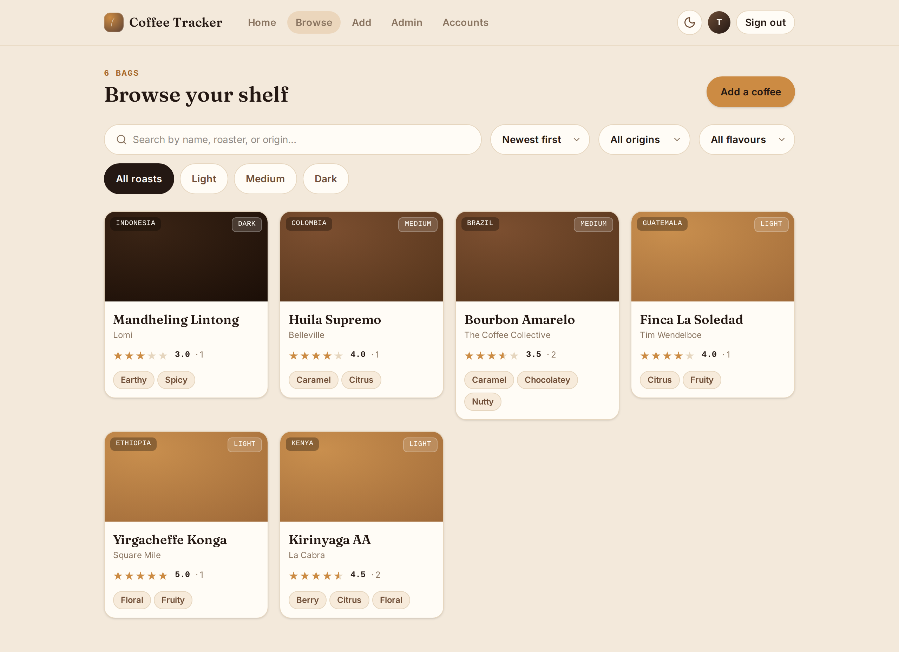
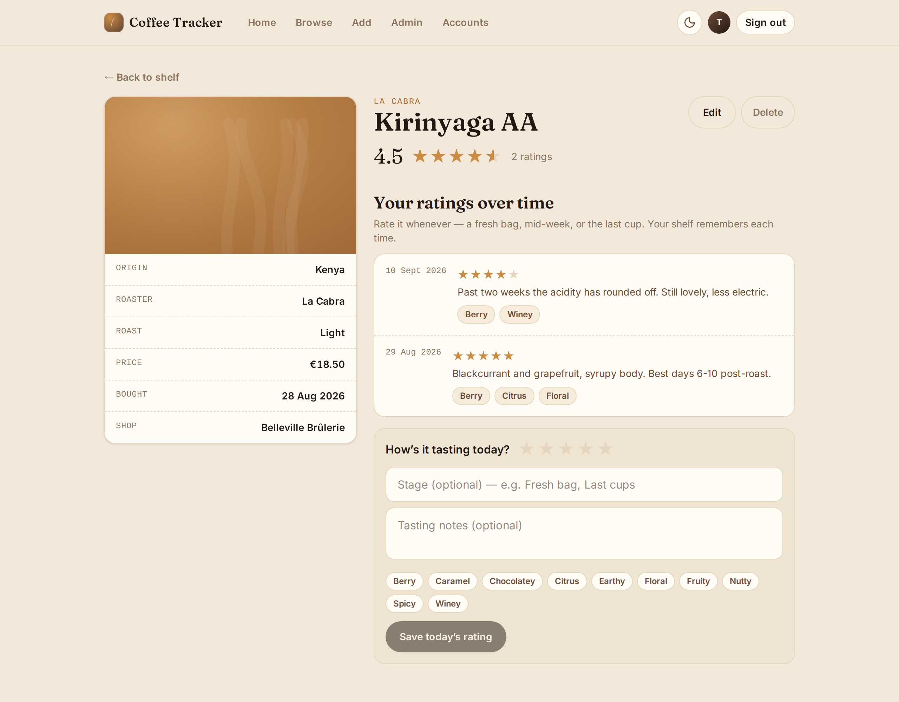
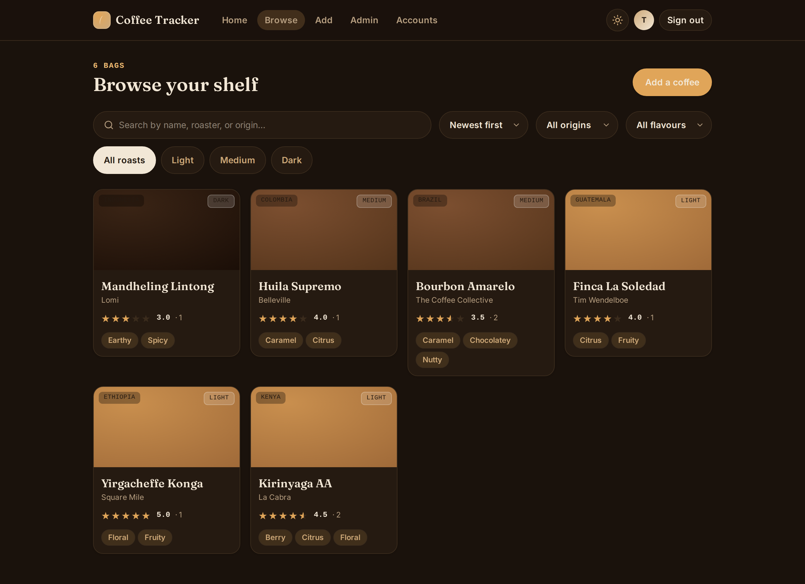

# Coffee Tracker

[](https://github.com/thomas-lg/coffee-tracker/actions/workflows/ci.yml)

A self-hosted web app to catalog the coffees I buy and rate them to taste, with
multiple users each keeping their own ratings. Built to be shared — anyone can
self-host it on a NAS via Docker.

This is a personal, for-fun project — a no-pressure space to learn modern C#/.NET
(and drink good coffee) on my own schedule. There's no roadmap and no promises
about when anything lands.



<table>
<tr>
<td width="50%"></td>
<td width="50%"></td>
</tr>
<tr>
<td><em>Every rating is kept and dated — a bag can be re-rated as it opens up.</em></td>
<td><em>Light and dark, following the system theme.</em></td>
</tr>
</table>

> Coffees with no photo get a gradient keyed to their roast level, which is what these
> screenshots show. Upload one and it takes the card.

## What it does

- **A shared shelf.** Name, roaster, origin, roast level, price, where you bought it
  and a photo. Search it, filter by origin or flavour, sort by newest, name or rating.
- **Ratings over time**, not one score per person: every review is dated and carries
  its own tasting notes, brew method, grind, ratio and flavour tags, so a bag can be
  re-rated as it opens up. Each coffee shows its running average and review count.
- **Snap-to-fill.** Photograph the bag; OCR reads the label and pre-fills the form.
- **Multi-user.** Everyone rates the same catalog independently. A coffee can only be
  edited by whoever added it, or an administrator.
- **Installable PWA** with light and dark theming, so it works from a phone home screen.
- **Two ways to sign in:** app accounts, or your own OpenID Connect provider with
  admin rights mapped from a group claim. See [Signing in](#signing-in).
- **Admin screens** for account policy (who may register, whether app accounts can
  sign in at all) and for reaping photos left behind by abandoned scans.

## Stack
- **Backend:** ASP.NET Core Web API (.NET 10), EF Core + SQLite (WAL mode),
  ASP.NET Core Identity + JWT.
- **Frontend:** Angular 22 (standalone components, signals, Signal Forms),
  shipped as an installable PWA.
- **Snap-to-fill:** photograph a coffee bag, and open-source OCR (Tesseract first,
  behind a swappable `IOcrService`) pre-fills the Add Coffee form.
- **Deploy:** GitHub Actions builds a `linux/amd64` + `linux/arm64` image and
  publishes it to GHCR; you install/update it manually from your NAS's Docker GUI.

See [docs/design-notes.md](./docs/design-notes.md) for the standing design rationale,
and [`openspec/changes/archive/`](./openspec/changes/archive/) for how each piece was built.

## Getting started (Dev Container)

Development happens inside a dev container, so the only host prerequisites are
Docker and the VS Code Dev Containers extension.

1. Clone the repo and open it in VS Code.
2. Run **Dev Containers: Reopen in Container**. The first build installs the .NET
   10 SDK, Node 24, the Angular CLI, `dotnet-ef`, and the native Tesseract OCR
   libraries, then prints a toolchain summary.
3. The API runs HTTP-only on `http://localhost:5000` and the Angular dev server on
   `http://localhost:4200` (both forwarded automatically). `http://localhost` is a
   secure context, so the PWA service worker and camera work without HTTPS in dev.

Conventions, architecture rules and maintainer notes live in [CLAUDE.md](./CLAUDE.md),
including the NuGet lock-file trap that bites every backend dependency bump.

## Running the tests

Three suites, all run in CI on every pull request.

```bash
dotnet test CoffeeTracker.sln     # backend: unit + HTTP integration
cd frontend && npm test           # frontend: unit (Vitest)
cd frontend && npm run e2e        # frontend: end-to-end (Playwright, Chromium)
```

The backend integration tests boot the real API through `WebApplicationFactory<Program>`
against a throwaway SQLite database. Each test gets its own, so they need nothing
running.

The e2e suite is the exception. Playwright starts only the Angular dev server on `:4200`
(`proxy.conf.json` forwards `/api` and `/photos`), so the API must already be up on
`:5000`, against an **empty** database: the suite's global setup claims the instance's
first account, which makes it the administrator, and reopens registration, so that
parallel tests aren't racing for the one registration a fresh instance allows.

```bash
rm -f backend/CoffeeTracker.Api/coffee.db
ASPNETCORE_ENVIRONMENT=Development dotnet run --project backend/CoffeeTracker.Api --urls http://localhost:5000
```

`Development` opens registration and sets `Ocr__Engine=none`, so no Tesseract is needed.
Provider sign-in is exercised against a minimal OpenID Connect provider the suite starts
in-process, with real discovery, JWKS, PKCE and nonce, so no external provider is involved.

## Install on Unraid (or any Docker host)

The published image is public at `ghcr.io/thomas-lg/coffee-tracker`. On Unraid,
add the container from [`deploy/unraid/my-coffee-tracker.xml`](./deploy/unraid/my-coffee-tracker.xml)
(or fill in the values below by hand), map the volumes, set the required env vars,
and **put it behind a reverse proxy that terminates HTTPS** (NPM, SWAG, Traefik,
Caddy). The PWA and camera require a secure context, and the container port should
never face the internet directly.

### Volumes

| Container path | Purpose                          |
| -------------- | -------------------------------- |
| `/config`      | SQLite database (`coffee.db`)    |
| `/photos`      | Uploaded coffee photos           |

> Back up `/config` and `/photos` **before pulling a new image**: startup runs EF
> migrations automatically and there is no rollback. The database uses WAL mode, so
> `/config` holds three files (`coffee.db`, `coffee.db-wal`, `coffee.db-shm`); for a
> consistent single-file backup run `sqlite3 coffee.db ".backup backup.db"`.

> **Permissions:** the container starts as root, `chown`s `/config` and `/photos` to
> `PUID:PGID` on startup, then drops to that user. Defaults are `99:100` (Unraid's
> `nobody:users`). If you see `SQLite Error 14: unable to open database file`, set
> `PUID`/`PGID` to match whoever owns your host volume directories.

### Environment variables

| Variable                          | Required | Default          | Description                                                                 |
| --------------------------------- | -------- | ---------------- | --------------------------------------------------------------------------- |
| `Jwt__Key`                        | **yes**  | —                | Long random secret for signing auth tokens. The app refuses to start without a strong value (`openssl rand -base64 48`). |
| `Jwt__Issuer`                     | no       | `coffee-tracker` | JWT issuer claim.                                                           |
| `Jwt__Audience`                   | no       | `coffee-tracker` | JWT audience claim.                                                         |
| `Jwt__AccessTokenMinutes`         | no       | `15`             | Access-token lifetime (minutes). Kept short; sessions persist via a rotating refresh token, so a stolen access token expires quickly. |
| `Jwt__RefreshTokenDays`           | no       | `14`             | Refresh-token lifetime (days), which is the effective session length. Refresh tokens rotate on use and are revoked on logout. |
| `Storage__SignedUrlLifetimeMinutes` | no     | `60`             | How long a signed `/photos/…` URL stays valid (minutes). Photos are served only via short-lived signed URLs, never anonymously. |
| `Oidc__Authority`                 | no       | —                | Base URL of an OpenID Connect provider (Authelia, Keycloak, Authentik, Google…). Set it with `Oidc__ClientId` to offer sign-in through that provider; leave both unset to run with app accounts only. Endpoints are discovered from `/.well-known/openid-configuration`. |
| `Oidc__ClientId`                  | no       | —                | The client id registered with that provider. Required whenever `Oidc__Authority` is set — the app refuses to start with only one of the two. |
| `Oidc__Scopes`                    | no       | `openid profile email` | Scopes requested from the provider. Add `groups` if you use the admin claim mapping below. |
| `Oidc__DisplayName`               | no       | —                | What to call the provider on the sign-in button (e.g. `Authelia`). Unset, the button reads "your identity provider" — the app never hard-codes which product it talks to. |
| `Oidc__AdminClaim`                | no       | —                | Claim carrying the admin assertion (e.g. `groups`). Set with `Oidc__AdminClaimValue`; both or neither. Unset, the first user to sign in through the provider becomes admin. |
| `Oidc__AdminClaimValue`           | no       | —                | Value `Oidc__AdminClaim` must carry to grant admin. Re-evaluated on every sign-in, so removing someone from the group revokes their rights at their next sign-in. |
| `ForwardedHeaders__KnownProxies`  | recommended | —             | Comma-separated host names or IPs of your reverse proxy, so the app trusts its `X-Forwarded-For`/`-Proto`. **Set this** behind a proxy — otherwise auth rate-limiting keys off the proxy's single IP and throttles every client together, and HSTS is not emitted. Prefer a name (`swag`, a service name, a DNS record) over an address, because an orchestrator assigns the address and a pinned IP holds only until the proxy restarts onto another one. Names are resolved at startup; one that cannot be resolved is ignored rather than guessed. |
| `Ocr__Engine`                     | no       | `tesseract`      | OCR engine for `/api/coffees/scan`: `tesseract` (uses the bundled native libs) or `none` (disables scanning → 503). |
| `Ocr__TessdataPath`               | no       | system path      | Override the tessdata directory; defaults to the `TESSDATA_PREFIX` system path (the image ships English data). |
| `Ocr__Language`                   | no       | `eng`            | Tesseract language code. |
| `Ocr__TimeoutSeconds`             | no       | `30`             | Hard ceiling on a single OCR run; a slower/stuck scan is terminated and returns `503` so it can't pin a worker. |
| `Ocr__MaxConcurrency`             | no       | `0` (≈ 2× CPUs)  | Max OCR processes running at once; extra scans queue instead of spawning unbounded `tesseract` processes. `0` resolves to twice the processor count. |
| `PUID`                            | no       | `99`             | User ID the app runs as. Set to match your host volume owner so `/config`/`/photos` are writable (Unraid default `99` = `nobody`). |
| `PGID`                            | no       | `100`            | Group ID the app runs as (Unraid default `100` = `users`). |

## Signing in

Two ways in, and an instance can offer either or both.

**App accounts** work out of the box. A brand-new instance accepts registrations until
its first account exists (that account becomes the administrator) and then closes
registration by itself, so an instance left on the internet is never sitting open by
accident. An administrator reopens it from **Admin → Account settings** to add people,
and registration reopened deliberately stays open until it is turned off again.

**An identity provider**, if you run one. Set `Oidc__Authority` and `Oidc__ClientId` to
any OpenID Connect provider and the sign-in screen gains a provider button. Register the
app as a *public* client using the authorization code flow with PKCE, with your app's
root URL as the redirect URI. Nothing in the app is specific to any provider: everything
else comes from its discovery document.

Identities are matched on the provider's stable subject, so someone changing their email
keeps their coffees. A first sign-in whose email matches an existing app account is
linked to it only when the provider asserts the address is verified; otherwise the
sign-in is refused rather than quietly creating a second account.

Linking is a handover: that account's app password and any sessions it had are retired,
leaving the provider as its only way in. Registration takes any address and confirms
none, so an app account bearing your address is not proof anyone owns it. Without this,
someone could open one in advance and keep a password on the account you are about to be
linked to, including whatever rights the provider then grants it. If you are migrating
your own app account to the provider, expect to sign in through the provider from then
on.

The provider is the guest list. Anyone it lets through gets an account on first sign-in,
so point the app at a provider you control and that gates who may use it (Authelia's
`access_control`, a Keycloak client role, a Google Workspace domain…). A provider that
accepts the whole world, plain Google for instance, makes the app accept the whole world
with it. Only an email the provider asserts as verified is recorded; otherwise the
account gets a placeholder address, so nobody can claim someone else's.

Once an administrator has signed in through the provider at least once, you can switch
app-account sign-in off entirely. Before that the app refuses to — it would be the last
way in.

If the provider later disappears (URL changed, certificate expired, instance gone) and
app-account sign-in is off, nobody can get in. Turn it back on directly in the database,
then restart the container:

```sh
sqlite3 /config/coffee.db "UPDATE AppSettings SET LocalLoginEnabled = 1;"
```

## Updating

Pull the new `:latest` (or a pinned `:sha-…` / `:vX.Y.Z`) tag in your Docker GUI
and recreate the container. Volumes persist your data across the update.

### Release channels

| Tag | Built from | Who gets it |
|---|---|---|
| `:latest` | `main`, once CI passes | The default. Nothing else moves it. |
| `:beta` | the `beta` branch, once CI passes | Only containers pinned to `:beta`. |
| `:vX.Y.Z` | a version tag | Pinned, immutable. |
| `:sha-…` | any published build | Pinned, immutable; pruned after 30 days. |

`beta` is for trying a change on real hardware before it reaches anyone. Merge into the
`beta` branch, wait for CI, and point a container at `:beta`. Nothing tracking `:latest`
sees it, and the two channels never share a build — a publish always builds the commit
whose CI passed, not whatever is on the default branch.

Going back is repointing the container at `:latest`. **Take a copy of `coffee.db`
first** if the beta carried a database migration: the schema change survives the
rollback, and while the old code tolerates a table it does not know about, restoring a
pre-migration file is the only way to truly undo one.

## Security notes

This app is designed to be internet-exposed and shared. No secrets are baked into the
image; they are all injected at runtime, and there is no default JWT key. A fresh
instance closes registration behind its first account. Login and register are
rate-limited, as are the anonymous config endpoint and label scanning, whose cost a
single caller could otherwise impose at will. The container runs as a non-root user.

Auth uses short-lived access tokens plus rotating, revocable refresh tokens, and
presenting a rotated token revokes the whole session family. Signing out revokes the
refresh token immediately; an access token already issued stays valid until it expires,
which is why it is kept to 15 minutes.

Uploaded photos are re-encoded on upload, which strips any embedded payload or metadata,
and they are served only through short-lived signed URLs, never anonymously. Every
response carries a content security policy with no inline script, plus
`X-Frame-Options: DENY`, `Referrer-Policy: no-referrer` and `nosniff`, so an injected
script has no way to run. That matters here because the session lives in `localStorage`.
See the Security section in [docs/design-notes.md](./docs/design-notes.md).

## Ideas for later

Nothing committed, just a parking lot for when the mood strikes:

- **Brew log** for per-cup extraction notes (grind, dose, yield, time) beyond a rating.
- **Wishlist & "finished bag"** states; optional low-stock nudges.
- **Stats & charts**: rating trends over time, favourite roasters/origins.
- **Export / import** (JSON/CSV) and a one-click backup endpoint.
- **OCR upgrade** to PaddleOCR or RapidOCR behind `IOcrService`, if Tesseract turns out
  weak on real bags.
- **i18n**. The UI is English-only today.

## Contributing

Bug reports and questions are welcome. See [CONTRIBUTING.md](./CONTRIBUTING.md) for
how the repo works, and [CLAUDE.md](./CLAUDE.md) for the architecture rules and the
gotchas worth knowing before changing anything.

Found a security problem? Please report it privately rather than in an issue.
[SECURITY.md](./SECURITY.md) has the details and says what's already known and
deliberate.

## Built with Claude

I use [Claude](https://claude.ai) (via Claude Code) to help design and build this
project.

## License

[MIT](./LICENSE) — do what you like with it, just keep the copyright notice.
